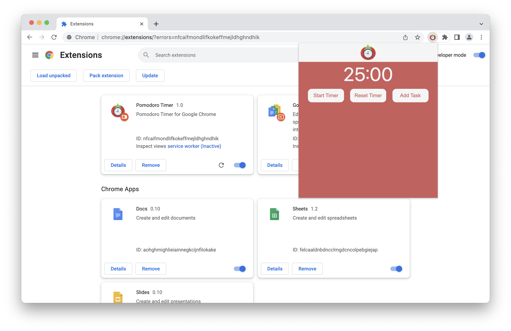
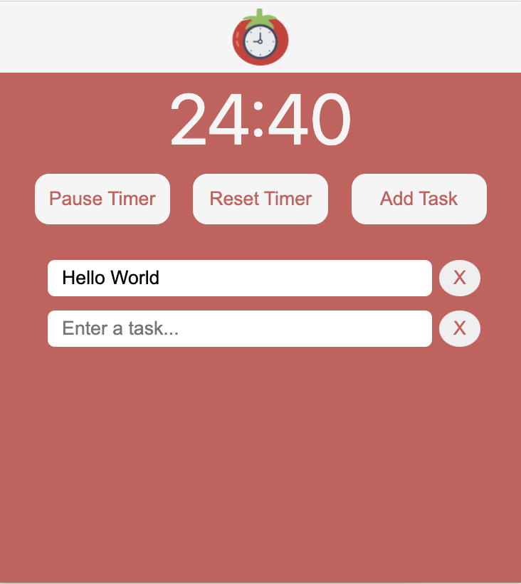
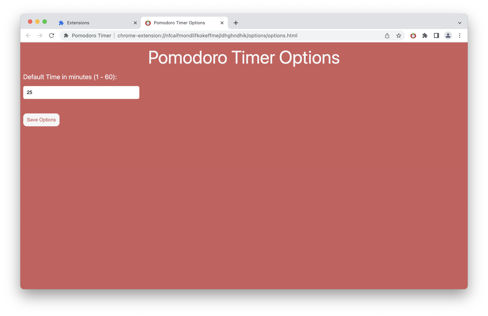

# Pomodoro Chrome Extension

This Chrome extension helps you to track your time in a Pomodoro-style.

## Installation

1. Clone the repository.
2. Open Chrome and go to `chrome://extensions`.
3. Click on `Developer mode`.
4. Click on `Load unpacked`.
5. Select the folder of the extension which is this repository.

## Usage

- Click on the `Start Timer` button to start the timer.
- Click on the `Pause Timer` button to pause the timer.
- Click on the `Reset Timer` button to reset the timer.
- Click on the `Add Task` button to add a task.

- Right click on the extension to open the options page.

